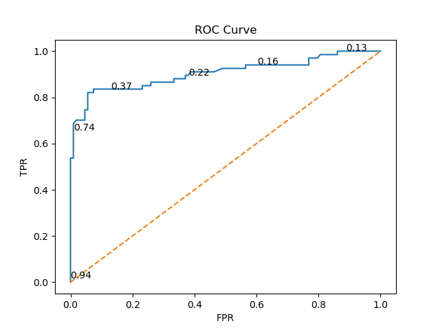
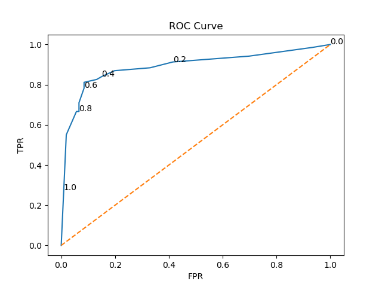
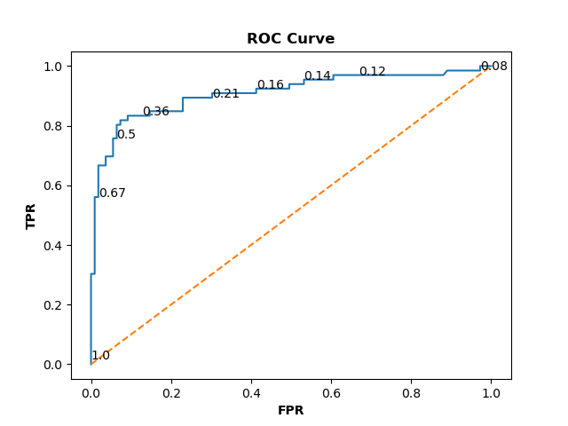
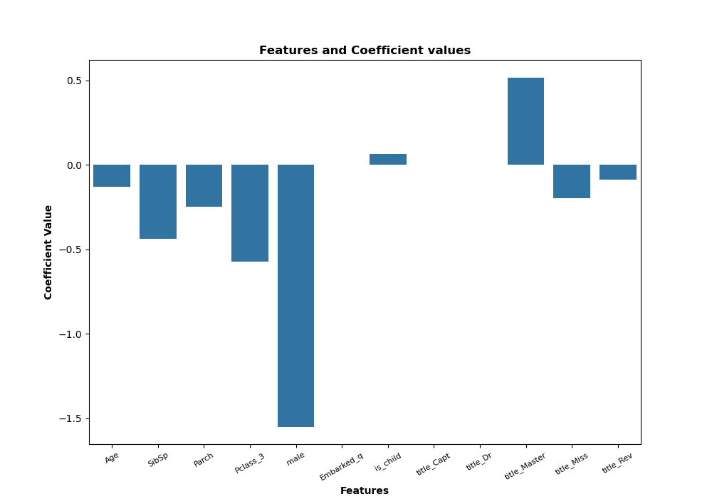
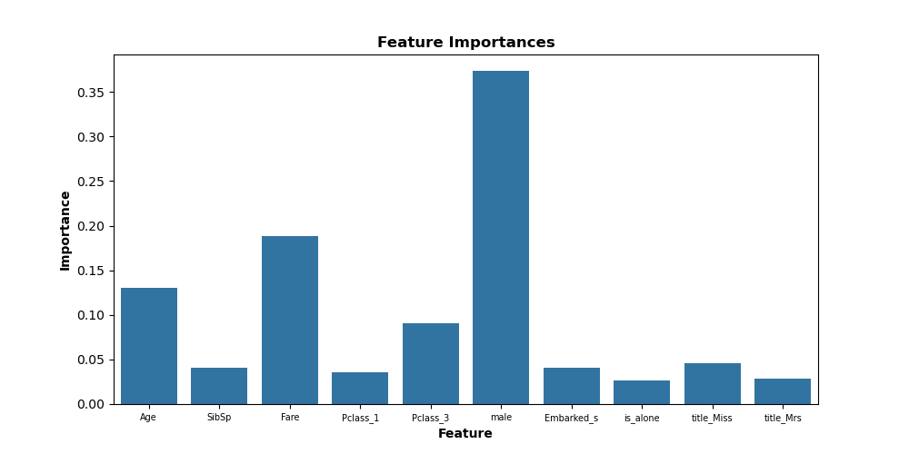
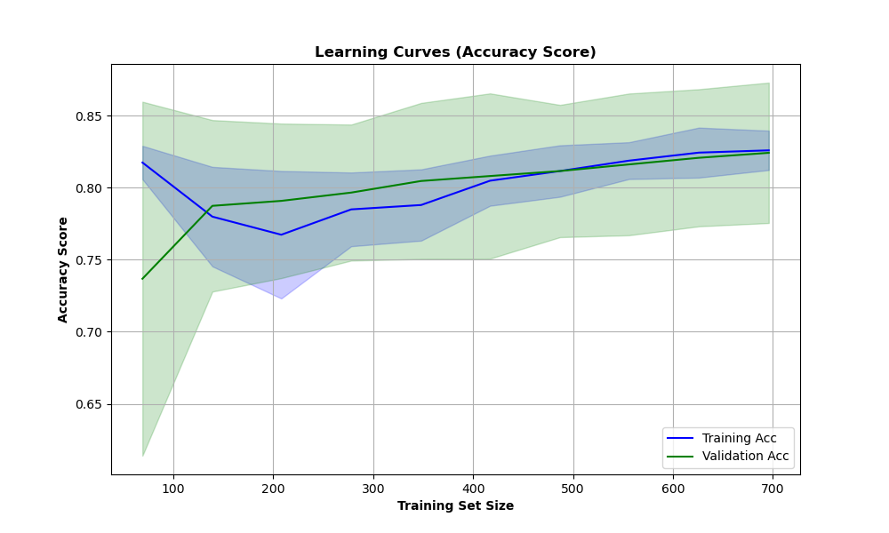
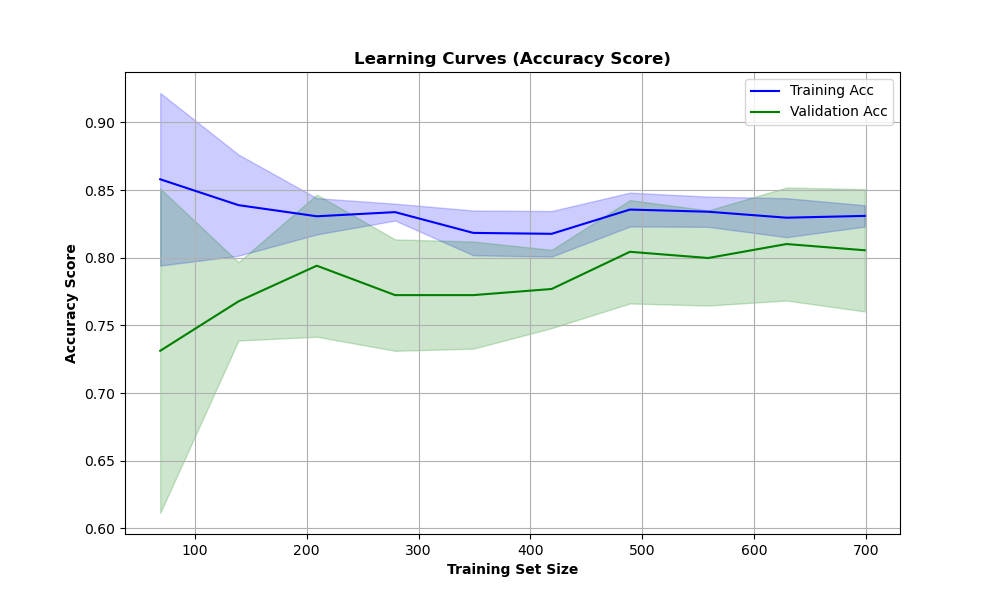
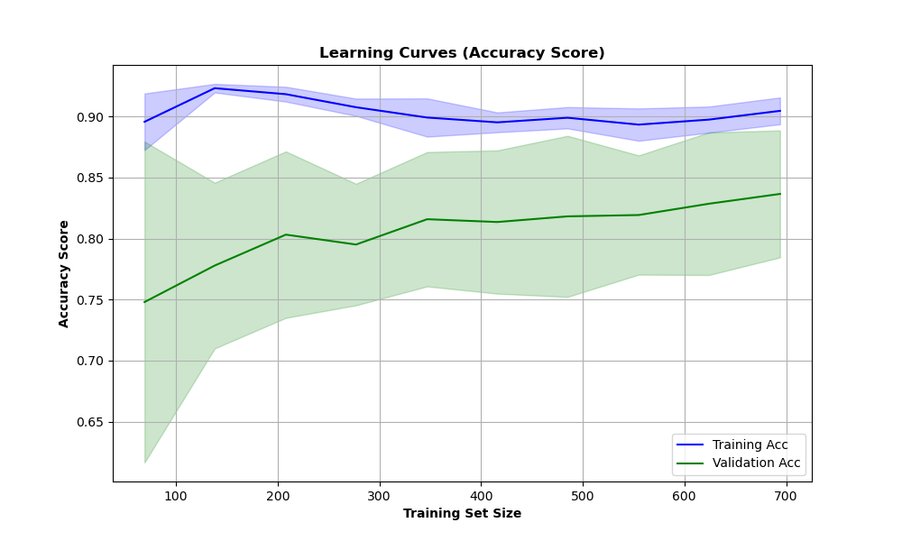

# Titanic-Dead-Or-Alive

# Introduction

This project analyzes the famous Titanic dataset to understand factors affecting survival rates and build machine learning models to predict passenger survival. This project includes:
- The cleaning of the dataset
- Visualisations
- Feature engineering
- Statistical tests
- Predictive modelling using Logistic Regression, K-Nearest Neighbours (KNN) and Random Forest

# Dataset

The dataset used contains information about each passenger onboard the titanic and their survival status. Lived(1), Died(0). Each passengers has several features such as:
- Pclass (passenger class)
- Name
- Sex
- Age
- SibSp (Number of siblings and spouses onboard)
- Parch (Number of parents and children onboard)
- Fare
- Cabin
- Embarked (Where they boarded the titanic)

The dataset can be found at - https://www.kaggle.com/datasets/yasserh/titanic-dataset/data

# Methodology

# 1. Dataset Cleaning and Preprocessing

The dataset was cleaned by:
- Removing any influential outliers
- Creating visualisations to see the spread of certain features
- Handling missing data using mean/median values as well as an iterative imputer
- Mapping one categorical column into several numerical columns ready for the machine learning models
- Created new features such as family_size, is_alone, is_child, is_senior, cabin_deck and title
- Prior to each machine learning model features were scaled and SMOTE oversampling was used to balance the outcome variable.
- To improve the performance of models sequential forward floating feature selection was used as well as hyperparameter tuning.

# 2. Statistical Tests

To explore the relationship between some of the features, these tests were conducted:
- One sample T-Test
  Checked if the mean fare price for people who embarked at C differed from the hypothesized population mean of the Titanic.
- Two sample T-Test
  Compared the mean ages for men against the mean ages for women to see who had significantly greater ages on the Titanic.
- Two sample T-Test
  Compared the mean fare for men against the mean fare for women to see who had significantly higher fare prices.
- Chi-squared Test
  Checked to see if there is an association between survival status and gender.
- Chi-squared Test
  Checked to see if there is an association between cheap/expensive fares and survival status.

Key Findings
- The people who embarked at C paid significantly greater than the rest of the people who boarded the Titanic.
- The mean age for men was significantly greater than the mean age of women.
- The mean male fare was significantly lower than the mean female fare.
- There is an association with survival status and gender. More women survived.
- There is an association between survival status and cheap/expensive tickets. People with cheaper tickets tended not to survive.

# 3. Models

The following models are trained and evaluated:
- Logistic Regression: A linear model for classification
- K-Nearest Neighbours (KNN): A distance based algorithm for classification
- Random forest: An ensemble method using decision trees for classification

# 4. Evaluation Metrics

The models were evaluated using:
- Accuracy: Fraction of correctly classified samples.
- Precision: Fraction of true positives among predicted positives.
- Recall: Fraction of true positives among actual positives.
- F1-Score: Harmonic mean of Precision and Recall.
- Confusion matrix - Showing all points classified as either true negative, false positive, false negative and true positive.
- ROC-AUC: Area under the Receiver Operating Characteristic curve.

# Installation

- Clone the repostiory using:
  git clone https://github.com/AdamBartlett7/Titanic-Dead-Or-Alive.git
- Navigate to the correct directory using:
  cd Titanic-Dead-Or-Alive
- To create your own virtual environment with the necessary python libraries use:
  conda env create -f environment.yml
- Open and run the files.

# Usage

- Run Titanic_cleaning.ipynb in sequential order to see the cleaning of the dataset, some visualisations on the features and feature engineering.
- Run titanic_stat_tests.ipynb in sequential order to see the statistical tests and the resulting p-values.
- Run Titanic_log_reg.ipynb in sequential order to see how logistic regression model was created and performed also how the hyperparameters were tuned.
- Run Titanic_knn.ipynb in sequential order to see how KNN model was created and performed also how the number for k was optimised.
- Run Titanic_rf.ipynb in sequential order to see how random forest model was created and performed also how the hyperparameters were tuned.

# Results

 | Model               |   Accuracy  |   Precision  |   Recall   |     F1    |    ROC-AUC   | 
 | ------------------- | ----------- | ------------ | ---------- | --------- | ------------ |
 | Logistic Regression |    89.7%    |     90.2%    |    82.1%   |   85.9%   |     90.4%    |
 | KNN                 |    87.4%    |     86.2%    |    81.2%   |   83.6%   |     89.1%    |
 | Random Forest       |    87.4%    |     89.3%    |    75.8%   |   82.0%   |     90.9%    |

# ROC Curve

- To evaluate the performance of the models, I plotted the ROC curves for all three models. The ROC curve illustrates the trade-off between True Positive Rate and False 
  Positive Rate, helping us assess the discriminatory power of each model. A higher Area Under the Curve (AUC) indicates better model performance. 
# Logistic Regression ROC Curve
  
# KNN ROC Curve
  
# Random Forest ROC Curve
  

# Confusion Matrix

   | Log Reg   | Predicted Died | Predicted Survived |
   | --------- | -------------- | ------------------ |
   | Died      |       102      |          6         |
   | Survived  |        12      |         55         |

   | KNN       | Predicted Died | Predicted Survived |
   | --------- | -------------- | ------------------ |
   | Died      |        97      |          9         |
   | Survived  |        13      |         56         |

   | Random Forest | Predicted Died | Predicted Survived |
   | ------------- | -------------- | ------------------ |
   | Died          |       103      |          6         |
   | Survived      |        16      |         50         |

- We can see that all three of the models are very similar when it comes to the confusion matrix. But the Logistic Regression model performed the best only getting 18 
  wrong predictions.

# Feature Coefficient & Feature Importance

- To understand the contribution of each feature to our models, I analyzed the feature coefficients from the Logistic Regression model and the feature importances from 
  the Random Forest model.
- The plot below shows the learned coefficients from our Logistic Regression model. Positive values indicate a positive association with a passenger surviving, while 
  negative values indicate a negative association.
  
- The plot below illustrates the feature importances assigned by our Random Forest model. Higher values indicate greater importance in making predictions.
  

# Learning Curve

- To assess how well the models learn from data and generalize to unseen samples, I plotted learning curves for each model. These curves show the relationship between 
  training and validation performance as the number of training samples increases. Learning curves are very important as it will help to diagnose any machine learning 
  problems. Such as the model underfitting or overfitting the data.

# Logistic Regression Learning Curve
  
  From this learning curve we can see that initially there is a small gap in scores as the model learns the data. But it quickly learns patterns in the data which allow 
  the scores to get closer. Also both the training and validation scores gradually increase at a similar rate meaning the model generalises to unseen data well. By the 
  end of the learning curve the rate at which the model is improving has slowed down meaning some additional data could help boost it's performance.

# KNN Learning Curve
  
  From this learning curve we can see that training score is high when the training size is lower but as more data is added the score slowly decreases as it tries to deal 
  with greater variation. For the validation line initially the model struggles to generalise well but with the addition of more data this helps solve the problem. The 
  constant fluctuations in both lines is to be expected as the dataset is fairly small and KNN is very sensitive to data distribution. By the end there is still a small 
  gap between the lines but with the addition of more data this would hopefully reduce it even further.

# Random Forest Learning Curve
  
  From this learning curve we can see that the training score starts and stays very high as expected from a random forest model due to their flexibility with training 
  data. For the validation line we can see that as more data is added the better the model generalises and improves the validation score. By the end there is still a 
  moderate gap between the two line indicating that the model might be slightly overfitting to the training data. Although with the addition of more data this gap could 
  potentially be reduced.

# License
- This project is licensed under the MIT License.

  
  

